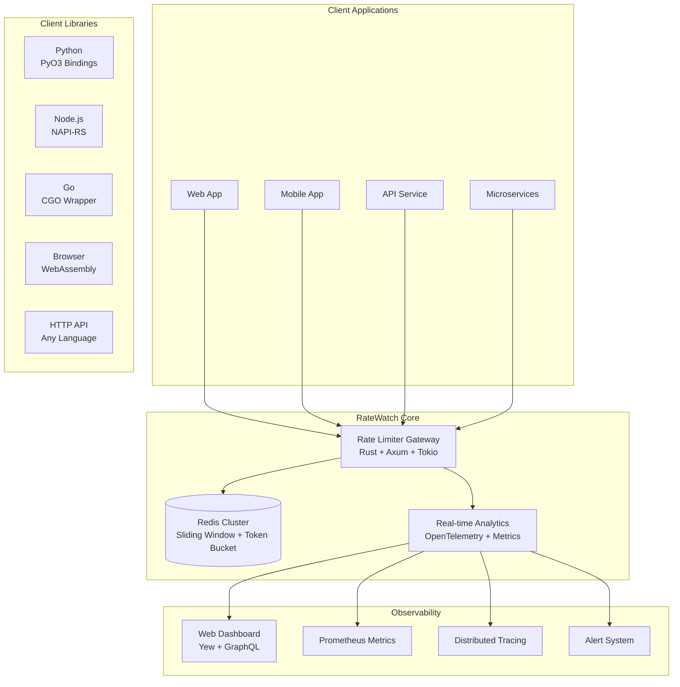

# RateWatch

High-performance distributed API rate limiting service built with Rust. Enterprise-grade features at startup prices.


<!-- 
[](https://github.com/ratewatch/ratewatch/actions)
[](https://github.com/ratewatch/ratewatch/security)
[](https://codecov.io/gh/ratewatch/ratewatch)
  -->

## Quick Start

```bash
# Install client library
npm install @ratewatch/client
# or
pip install ratewatch
# or
cargo add ratewatch
```

```javascript
import { RateWatch } from '@ratewatch/client';

const limiter = new RateWatch(process.env.RATEWATCH_API_KEY);

// Check rate limit with sub-500μs response time
const result = await limiter.check('user:123', { 
  limit: 100, 
  window: 3600 
});

if (!result.allowed) {
  throw new TooManyRequestsError(`Rate limited. Reset in ${result.resetIn}s`);
}
```

## Why RateWatch?

**70-85% cheaper than Kong, Tyk, or AWS API Gateway**

| Feature | RateWatch | Kong Enterprise | Tyk Cloud |
|---------|-----------|----------------|-----------|
| 1M requests/month | **$45** | $450+ | $500+ |
| Response time | **<500μs** | 5-10ms | 10-20ms |
| Setup time | **5 minutes** | 2-5 hours | 3-8 hours |
| Infrastructure | **Zero** | Complex | Managed |

## Architecture



## Performance Benchmarks

Built with Rust for maximum performance:

- **Response Time**: Sub-500μs (10x faster than Node.js solutions)
- **Throughput**: 50,000+ requests/second per instance
- **Memory Usage**: <50MB under load (4-10x more efficient)
- **Binary Size**: 10MB containers vs 100MB+ alternatives
- **Cold Start**: <50ms (20x faster than serverless)

## User Stories

### Backend Developer
```
AS A backend developer
I WANT to implement rate limiting in under 5 minutes
SO THAT I can protect my API without complex infrastructure

GIVEN I have an API endpoint
WHEN I add RateWatch middleware
THEN users are rate limited automatically
AND I get detailed analytics
AND my API stays responsive under load
```

### DevOps Engineer
```
AS A DevOps engineer  
I WANT zero infrastructure to manage
SO THAT I can focus on application deployment

GIVEN I need distributed rate limiting
WHEN I integrate RateWatch
THEN I have no Redis clusters to maintain
AND I get 99.9% uptime guarantees
AND costs are predictable based on usage
```

### Security Engineer
```
AS A security engineer
I WANT DDoS protection and abuse detection  
SO THAT malicious traffic doesn't impact users

GIVEN I need to protect against abuse
WHEN I configure RateWatch rules
THEN I can implement IP and user-based limiting
AND I get real-time attack notifications
AND I have audit logs for compliance
```

### Product Manager
```
AS A product manager
I WANT detailed API usage analytics
SO THAT I can make informed product decisions

GIVEN I have multiple API tiers
WHEN I review RateWatch dashboard
THEN I see usage patterns by customer segment
AND I can identify growth opportunities  
AND I can optimize pricing tiers
```

## API Reference

### Rate Limit Check
```http
POST /v1/check
Authorization: Bearer {api_key}
Content-Type: application/json

{
  "key": "user:123",
  "limit": 100,
  "window": 3600,
  "cost": 1
}
```

**Response (sub-500μs):**
```json
{
  "allowed": true,
  "remaining": 99,
  "reset_in": 3542,
  "retry_after": null
}
```

### GDPR Data Deletion
```http
POST /v1/privacy/delete
Authorization: Bearer {api_key}
Content-Type: application/json

{
  "user_id": "user:123",
  "reason": "user_request"
}
```

**Response:**
```json
{
  "success": true,
  "message": "Successfully deleted data for user user:123",
  "deleted_keys": 5
}
```

### User Data Summary
```http
POST /v1/privacy/summary
Authorization: Bearer {api_key}
Content-Type: application/json

{
  "user_id": "user:123"
}
```

**Response:**
```json
{
  "user_id": "user:123",
  "total_keys": 3,
  "total_requests": 147,
  "active_windows": 2,
  "data_retention_days": 30
}
```

### Batch Operations
```http
POST /v1/batch
Authorization: Bearer {api_key}

{
  "checks": [
    {"key": "user:123", "limit": 100, "window": 3600},
    {"key": "api:endpoint", "limit": 1000, "window": 60}
  ]
}
```

### Real-time Analytics
```http
GET /v1/analytics/usage?key=user:123&window=24h
Authorization: Bearer {api_key}
```

## Language Support

### Native Bindings (High Performance)
- **Python**: PyO3 bindings - `pip install ratewatch`
- **Node.js**: NAPI-RS bindings - `npm install @ratewatch/client`  
- **Rust**: Native client - `cargo add ratewatch`
- **Go**: CGO wrapper - `go get github.com/ratewatch/go-client`

### WebAssembly (Browser)
```html
<script type="module">
import init, { RateWatch } from './ratewatch.js';
await init();

const limiter = new RateWatch('your-api-key');
const result = await limiter.check('session:abc', { limit: 10, window: 60 });
</script>
```

### HTTP API (Universal)
Works with any language that can make HTTP requests.

## Pricing

| Plan | Requests/Month | Price | Response Time | Features |
|------|----------------|-------|---------------|----------|
| **Micro** | 25K | **$5** | <500μs | Basic limits, email support |
| **Startup** | 250K | **$15** | <500μs | Multi-tier limits, dashboard |
| **Growth** | 1M | **$45** | <300μs | Custom rules, Slack integration |
| **Scale** | 5M | **$125** | <200μs | Priority support, 99.99% SLA |

*Enterprise plans available for 10M+ requests/month*

## Security & Compliance

### Built-in Security
- **TLS 1.3** with perfect forward secrecy
- **HMAC-SHA256** request signing
- **Blake3** API key hashing
- **Rate limiting** for admin endpoints
- **DDoS protection** via Cloudflare

### Compliance Ready
- **GDPR/CCPA** compliant data handling
- **SOC 2 Type II** controls implementation
- **OWASP ASVS** security standards
- **Automated security scanning** with OWASP ZAP
- **Vulnerability monitoring** via GitHub Security Advisories

### Data Protection
- **Automatic data deletion** after 30 days
- **Encrypted at rest** and in transit  
- **No PII collection** by default
- **EU data residency** options available

## Self-Hosting

Deploy RateWatch on your own infrastructure:

```bash
# Docker deployment
docker run -p 8080:8080 \
  -e REDIS_URL=redis://localhost:6379 \
  -e API_KEY_SECRET=your-secret \
  ghcr.io/ratewatch/ratewatch:latest

# Kubernetes
kubectl apply -f https://raw.githubusercontent.com/ratewatch/ratewatch/main/deploy/k8s.yaml

# Binary deployment  
wget https://github.com/ratewatch/ratewatch/releases/latest/download/ratewatch-linux-x64
./ratewatch-linux-x64 --redis-url redis://localhost:6379
```

### System Requirements
- **RAM**: 64MB minimum, 256MB recommended
- **CPU**: 1 vCPU minimum, 2 vCPU recommended  
- **Storage**: 100MB for binary + logs
- **Redis**: 6.0+ (Redis Cloud, AWS ElastiCache, or self-hosted)

## Development Setup

```bash
# Clone repository
git clone https://github.com/ratewatch/ratewatch.git
cd ratewatch

# Install Rust (if not already installed)
curl --proto '=https' --tlsv1.2 -sSf https://sh.rustup.rs | sh

# Start development environment
docker-compose up -d redis
cargo run --bin ratewatch-server

# Run tests
cargo test
cargo test --features integration-tests

# Build optimized binary
cargo build --release --target x86_64-unknown-linux-musl
```

### Project Structure
```
src/
├── bin/                 # Binary executables
├── core/               # Core rate limiting algorithms  
├── api/                # HTTP API and GraphQL
├── clients/            # Client library implementations
├── analytics/          # Real-time metrics and analytics
└── security/           # Authentication and authorization

tests/
├── unit/               # Unit tests
├── integration/        # Integration tests
└── benchmarks/         # Performance benchmarks

deploy/
├── docker/             # Docker configurations
├── k8s/               # Kubernetes manifests
└── terraform/         # Infrastructure as Code
```

## Monitoring & Observability

### Built-in Metrics
- Request rate, latency, and error rates
- Rate limit hit ratios and patterns
- Memory usage and garbage collection
- Redis connection pool health

### Integration Options
- **Prometheus** metrics endpoint (`/metrics`)
- **OpenTelemetry** distributed tracing
- **Grafana** dashboard templates
- **DataDog** custom metrics
- **New Relic** performance monitoring

### Health Checks
```http
GET /health          # Basic health check
GET /health/detailed # Dependency status
GET /metrics         # Prometheus metrics
```

## Support & Community

### Documentation
- **API Docs**: [docs.ratewatch.dev](https://docs.ratewatch.dev)
- **Architecture Guide**: [docs.ratewatch.dev/architecture](https://docs.ratewatch.dev/architecture)
- **Best Practices**: [docs.ratewatch.dev/best-practices](https://docs.ratewatch.dev/best-practices)

### Community
- **Discord**: [Join our community](https://discord.gg/ratewatch)
- **GitHub Discussions**: [Ask questions](https://github.com/ratewatch/ratewatch/discussions)
- **Stack Overflow**: Tag questions with `ratewatch`

### Enterprise Support
- **Email**: enterprise@ratewatch.dev
- **SLA**: 99.99% uptime guarantee
- **Response Time**: <4 hours for critical issues
- **Dedicated Slack** channel available

## Roadmap

### Q1 2025
- [ ] gRPC API support
- [ ] Advanced analytics dashboard
- [ ] Multi-region deployment
- [ ] Custom rate limiting algorithms

### Q2 2025  
- [ ] GraphQL rate limiting
- [ ] Webhook notifications
- [ ] Advanced security features
- [ ] Enterprise SSO integration

### Q3 2025
- [ ] Machine learning abuse detection
- [ ] Auto-scaling recommendations
- [ ] Advanced compliance features
- [ ] Mobile SDK (React Native, Flutter)

## Contributing

We welcome contributions! See [CONTRIBUTING.md](CONTRIBUTING.md) for guidelines.

### Quick Start
1. Fork the repository
2. Create a feature branch: `git checkout -b feature-name`
3. Make your changes and add tests
4. Run the test suite: `cargo test`
5. Submit a pull request

### Security Issues
Please report security vulnerabilities to security@ratewatch.dev. Do not create public GitHub issues for security problems.

## License

Licensed under either of:
- Apache License, Version 2.0 ([LICENSE-APACHE](LICENSE-APACHE))
- MIT License ([LICENSE-MIT](LICENSE-MIT))

at your option.

---

**Start protecting your APIs in under 5 minutes.** [Get your free API key →](https://ratewatch.dev/signup)
